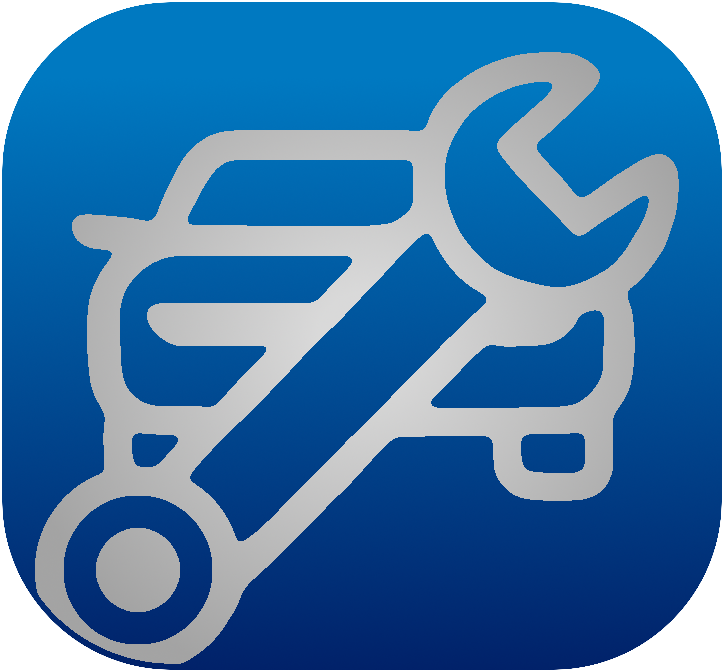

<a id="readme-top"></a>

<div align="center">
  <a href="https://github.com/quickwrench/quickwrench-api">
    
  </a>
  <h2 align="center">Quickwrench API</h2>
  <p align="center">
    Backend API powering the Quickwrench web application ⚡
    <p align="center">
      <a href="https://techforpalestine.org/learn-more"></a>
      
      
      
      
      
    </p>
    <a href="#getting-started">Getting Started</a>
    ·
    <a href="https://github.com/quickwrench/quickwrench-api/issues">Report Bug</a>
    ·
    <a href="https://github.com/quickwrench/quickwrench-api/issues">Request Feature</a>

  </p>
</div>

## About The Project ✨

QuickWrench is an innovative platform designed to connect users with trusted car mechanics for scheduling maintenance and repair services. With QuickWrench, workshops can grow their customer base while users enjoy seamless appointment scheduling, tailored service suggestions, and reliable reviews.

<p align="right">(<a href="#readme-top">back to top</a>)</p>

<a id="getting-started"></a>

## Getting Started 🚀

Follow these steps to set up the project locally.

### Prerequisites 📦

- Python 3.12+

```sh
sudo apt install python3
```

- Docker (optional for containerized deployment)

```sh
sudo apt install docker.io
```

### Installation ⚙️

1. Clone the repo

```sh
git clone https://github.com/quickwrench/quickwrench-api.git
```

2. Navigate to the project directory

```sh
cd quickwrench-api
```

3. Set up a virtual environment and activate it

```sh
python3 -m venv env
source env/bin/activate
```

4. Install dependencies

```sh
pip install -r reqs/dev.txt
```

5. Apply database migrations and load initial data

```sh
python manage.py migrate
python manage.py loaddata
```

<p align="right">(<a href="#readme-top">back to top</a>)</p>

## Usage 🔧

Here is how to use the project:

1. Start the development server

```sh
python manage.py runserver
```

2. Visit `http://127.0.0.1:8000` in your browser.

<p align="right">(<a href="#readme-top">back to top</a>)</p>

## Contributing 👥

Contributions are welcome! To get started:

1. Fork the repository
2. Create a branch for your feature (`git checkout -b feat/amazing-feature`)
3. Commit your changes (`git commit -m 'feat: add amazing-feature'`)
4. Push the branch (`git push origin feat/amazing-feature`)
5. Open a Pull Request

<p align="right">(<a href="#readme-top">back to top</a>)</p>

## License 📜

Distributed under the GPL v3 License. See `LICENSE.txt` for more information.

<p align="right">(<a href="#readme-top">back to top</a>)</p>
